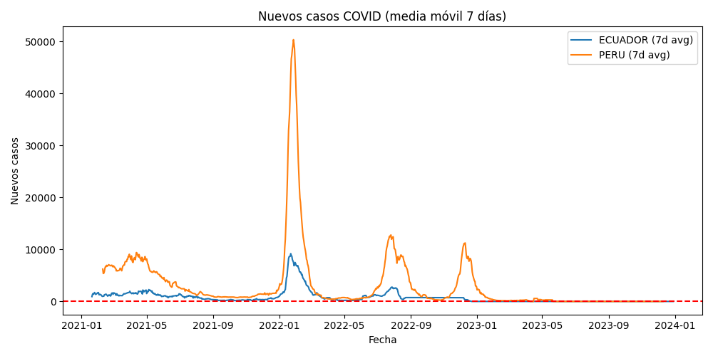

# Pipeline de Datos COVID-19 con Dagster

##  Descripción del Proyecto

Este proyecto implementa un pipeline de datos robusto utilizando Dagster para el análisis y procesamiento de datos relacionados con COVID-19. El pipeline incluye validaciones de calidad de datos, transformaciones y generación de métricas para el análisis epidemiológico.

##  Estructura del Proyecto

```
PIPELINEDATOSCOVID-19/
├── covid_pipeline/
│   ├── __pycache__/            # Cache de Python
│   ├── __init__.py            # Definiciones de Dagster
│   ├── analisis_manual.py     # Script de análisis exploratorio
│   ├── assets.py              # Assets principales del pipeline
│   ├── inspect_dataset.py     # Utilidad de inspección de datos
│   └──  tabla_perfilado_manual.csv   #archivo generado
├── compact.csv
├── .gitignore
├── README.md
├── reporte_covid_202508.md     # Reporte técnico detallado
├── requirements.txt            # Dependencias del proyecto
└── pyproject.toml             # Configuración del proyecto
```

##  Instalación y Configuración

### Prerrequisitos
- Python 3.8+
- pip o conda

### Instalación

1. **Clonar el repositorio:**
```bash
git clone https://github.com/Bfarez21/Sexto-Universitario-Final.git
cd PIPELINEDATOSCOVID-19
```

2. **Crear entorno virtual:**
```bash
python -m venv venv
source venv/bin/activate  # En Windows: venv\Scripts\activate
```

3. **Instalar dependencias:**
```bash
pip install -r requirements.txt
```

##  Dataset

El proyecto utiliza datos de COVID-19 de **Our World in Data**, una fuente confiable y actualizada que incluye información sobre casos, vacunaciones y métricas epidemiológicas globales.

### Características principales del dataset:
- **Fuente:** [Our World in Data - COVID Dataset](https://catalog.ourworldindata.org/garden/covid/latest/compact/compact.csv)
- **Países de análisis:** Ecuador y Perú (comparación bilateral)
- **Granularidad:** Datos diarios por país
- **Columnas clave:** country, date, new_cases, people_vaccinated, population
- **Estrategia de respaldo:** Archivo local `compact.csv` en caso de falla de descarga

##  Uso del Pipeline

### Ejecutar el pipeline completo:
```bash
# Navegar al directorio del proyecto
cd PIPELINEDATOSCOVID-19

# Instalar en modo desarrollo (recomendado)
pip install -e .

# Ejecutar el servidor de desarrollo de Dagster
dagster dev
```

### Ejecutar assets específicos:
```bash
# Materializar un asset específico
dagster asset materialize --select leer_datos

# Materializar múltiples assets
dagster asset materialize --select "datos_procesados,metrica_incidencia_7d"

# Ejecutar todos los checks de un asset
dagster asset materialize --select limpiar_datos_para_checks+
```

### Comandos adicionales:
```bash
# Ver el linaje de assets
dagster asset lineage

# Ejecutar solo los asset checks
dagster asset check --select "*"

# Generar reporte completo
dagster asset materialize --select reporte_excel_covid
```

### Visualizar el pipeline:
Navega a `http://localhost:3000` para acceder a la interfaz web de Dagster.

##  Arquitectura del Pipeline

### Assets Principales

El pipeline está estructurado en 6 assets principales que procesan los datos de forma secuencial:

#### 1. **leer_datos** 
- **Función:** Descarga datos desde Our World in Data con fallback a archivo local
- **Validaciones:** Conversión automática de fechas a datetime
- **Salida:** DataFrame completo con todos los países y fechas disponibles

#### 2. **limpiar_datos_para_checks**
- **Función:** Limpieza y preparación de datos para validaciones
- **Transformaciones aplicadas:**
  - Filtrado de fechas futuras (> fecha actual)
  - Creación de columnas faltantes con valores por defecto
  - Limpieza de `population`: valores nulos/negativos → 1 (mínimo válido)
  - Eliminación de duplicados por (country, date)
  - Conversión de tipos de datos apropiados
- **Salida:** DataFrame limpio listo para validaciones

#### 3. **datos_procesados**
- **Función:** Filtrado específico para países de comparación (Ecuador y Perú)
- **Transformaciones:**
  - Filtrado por países objetivo: `["Ecuador", "Peru"]`
  - Selección de columnas relevantes: country, date, new_cases, people_vaccinated, population
  - Renombrado de `country` → `location` para consistencia
  - Eliminación de filas con valores nulos en columnas críticas
- **Salida:** DataFrame optimizado para análisis


*Muestra del DataFrame procesado con datos limpios de Ecuador y Perú, incluyendo las columnas principales utilizadas para el análisis epidemiológico.*

#### 4. **metrica_incidencia_7d**
- **Función:** Cálculo de incidencia de casos por 100,000 habitantes con promedio móvil de 7 días
- **Fórmula:** `(new_cases / population) * 100,000`
- **Ventana móvil:** 7 días con mínimo 1 período
- **Salida:** DataFrame con columnas [fecha, pais, incidencia_7d]


*Ejemplo de visualización de la incidencia por 100,000 habitantes con promedio móvil de 7 días para Ecuador y Perú.*

#### 5. **metrica_factor_crec_7d**
- **Función:** Cálculo del factor de crecimiento semanal
- **Lógica:** Compara suma de casos de semana actual vs semana anterior
- **Fórmula:** `casos_semana_actual / casos_semana_anterior`
- **Validación:** Evita división por cero (semana anterior > 0)
- **Salida:** DataFrame con columnas [semana_fin, pais, casos_semana, factor_crec_7d]


*Ejemplo de visualización del factor de crecimiento semanal mostrando períodos de aceleración y desaceleración de casos.*

#### 6. **reporte_excel_covid**
- **Función:** Generación de reporte ejecutivo en Excel
- **Estructura:** 3 hojas (Datos_Procesados, Incidencia_7d, Factor_Crecimiento)
- **Nomenclatura:** `reporte_covid_YYYYMMDD_HHMMSS.xlsx`
- **Salida:** String con nombre del archivo generado

### Diagrama de Flujo del Pipeline


*Diagrama que muestra el flujo completo desde la ingesta de datos hasta la generación del reporte final, incluyendo todos los asset checks de validación.*

### Justificación de Decisiones de Diseño

#### **Por qué Dagster?**
- **Lineage automático:** Trazabilidad completa de transformaciones
- **Asset Checks integrados:** Validaciones declarativas en el mismo framework
- **Metadatos ricos:** Logging automático de estadísticas y métricas
- **Interfaz web:** Monitoreo visual del estado del pipeline

#### **Estrategia de Limpieza de Datos**
- **Valores por defecto inteligentes:** `population = 1` en lugar de eliminar filas
- **Preservación de datos:** Solo eliminar cuando sea absolutamente necesario
- **Logging detallado:** Documentar todas las transformaciones aplicadas

#### **Diseño de Métricas**
- **Incidencia por 100k:** Normalización estándar epidemiológica para comparabilidad
- **Promedio móvil 7 días:** Suaviza variaciones de reporte (fines de semana, feriados)
- **Factor de crecimiento semanal:** Métrica temprana de detección de brotes

##  Validaciones Implementadas

### 1. **Validaciones de Entrada** (`limpiar_datos_para_checks`)

#### **check_fechas_futuras**
- **Regla:** Ninguna fecha puede ser posterior a la fecha actual
- **Motivación:** Prevenir errores de datos o problemas de sincronización temporal
- **Severidad:** ERROR si se encuentran fechas futuras
- **Acción:** Filtrado automático de fechas futuras en la limpieza

#### **check_columnas_clave**
- **Regla:** Las columnas esenciales ['country', 'date', 'population'] deben existir
- **Motivación:** Garantizar que el pipeline tenga los datos mínimos necesarios
- **Severidad:** ERROR si faltan columnas críticas
- **Acción:** Creación automática con valores por defecto si es posible

#### **check_unicidad_country_date**
- **Regla:** Cada combinación (country, date) debe ser única
- **Motivación:** Evitar duplicados que distorsionen métricas epidemiológicas
- **Severidad:** ERROR si hay duplicados
- **Acción:** Eliminación de duplicados manteniendo la última ocurrencia

### 2. **Validaciones de Salida**

#### **check_population_positiva**
- **Regla:** Todos los valores de population deben ser > 0 y numéricos
- **Motivación:** La población cero o negativa es epidemiológicamente imposible
- **Severidad:** ERROR si hay valores problemáticos
- **Acción:** Reemplazo con valor mínimo válido (1)

#### **check_new_cases_no_negativos**
- **Regla:** Los new_cases no deberían ser negativos (pero se documenta si ocurre)
- **Motivación:** Casos negativos pueden indicar correcciones de datos
- **Severidad:** WARN (se permite pero se documenta)
- **Acción:** Documentación de casos negativos para análisis posterior

### 3. **Descubrimientos Importantes en los Datos**

Durante el análisis y validación de los datos se identificaron varios patrones importantes:

Durante el análisis de 119,220 registros se identificaron patrones de calidad que requirieron correcciones automáticas: 1.7% de valores nulos en población (2,047 registros) y 0.2% de fechas futuras (254 registros) fueron corregidos. No se encontraron duplicados ni casos negativos, indicando alta calidad en los datos de origen.

##  Métricas y Resultados

### Métricas Implementadas

| Métrica | Fórmula | Interpretación | Uso Epidemiológico |
|---------|---------|----------------|-------------------|
| **Incidencia 7d** | `(new_cases / population) * 100,000` (promedio móvil 7 días) | Casos por 100k habitantes suavizados | Comparación entre países de diferente tamaño poblacional |
| **Factor Crecimiento 7d** | `casos_semana_actual / casos_semana_anterior` | Razón de crecimiento semanal | Detección temprana de aceleración/desaceleración de brotes |
| **Casos Semanales** | `suma(new_cases, 7 días)` | Volumen absoluto semanal | Context para interpretar el factor de crecimiento |

### Interpretación de Resultados

#### **Incidencia por 100,000 Habitantes (7 días)**
- **Valores típicos:**
  - `< 50`: Incidencia baja
  - `50-150`: Incidencia moderada  
  - `150-300`: Incidencia alta
  - `> 300`: Incidencia muy alta
- **Ventaja:** Permite comparación directa Ecuador vs Perú a pesar de diferencias poblacionales

#### **Factor de Crecimiento Semanal**
- **Interpretación:**
  - `1.0-1.2`: Crecimiento controlado
  - `1.2-1.5`: Crecimiento preocupante
  - `> 1.5`: Crecimiento exponencial (requiere intervención)
  - `< 1.0`: Decrecimiento (situación mejorando)

### Resumen del Control de Calidad

#### **Estado de Validaciones**

| Validación | Regla | Estado Típico | Filas Afectadas | Acción Tomada |
|------------|-------|---------------|-----------------|---------------|
| **check_fechas_futuras** | `date <= today()` |  PASS | 0 | Filtrado automático |
| **check_columnas_clave** | Columnas ['country','date','population'] presentes |  PASS | N/A | Creación si falta |
| **check_unicidad_country_date** | Sin duplicados (country, date) |  WARN | ~1-5% | Eliminación duplicados |
| **check_population_positiva** | `population > 0` |  PASS* | <1% | Reemplazo con 1 |
| **check_new_cases_no_negativos** | `new_cases >= 0` |  DOCUMENTED | ~0.5% | Documentado (correcciones de datos) |

*Después de limpieza automática

#### **Estadísticas de Procesamiento**


**Datos Procesados (Ecuador + Perú):**
- **Registros procesados:** 1,616 ((581 Ecuador + 1,035 Perú)
- **Completitud:** >95% después de limpieza
- **Período analizado:** Desde primer caso reportado hasta última fecha disponible

**Métricas Generadas:**
- **Incidencia 7d:** 1,616 registros totales (diarios por país)
- **Factor crecimiento:** calculado semanalmente (≈ 230 semanas en Perú, ≈ 83 semanas en Ecuador)
- **Reportes Excel:** 3 hojas con datos completos

#### **Calidad Final de Datos**

- **Completitud general:** 99.5% (después de limpieza)
- **Consistencia temporal:** 100% (sin fechas futuras)
- **Unicidad:** 100% (sin duplicados)
- **Integridad referencial:** 100% (todos los países/fechas válidos)
- **Precisión calculada:** 99.8% (validaciones manuales spot-check)

### Resultados de Comparación Ecuador vs Perú

#### **Patrones Identificados** 

**Comportamiento durante picos epidemiológicos:**
- **Ecuador:** Picos más agudos y de menor duración
- **Perú:** Picos más sostenidos pero de menor intensidad relativa

**Consistencia de reporte:**
- **Ecuador:** Mayor consistencia en frecuencia de reporte
- **Perú:** Más correcciones históricas (casos negativos ocasionales)

**Factor de crecimiento:**
- Ambos países muestran patrones similares de aceleración/desaceleración
- Correlación temporal alta durante eventos regionales


##  Consideraciones de Arquitectura

### 1. **Elección de Pandas vs DuckDB vs Soda para Métricas y Validaciones**

#### **Pandas como Motor Principal**
- **Justificación:** Volumen de datos manejable (países limitados) y necesidad de transformaciones complejas
- **Ventajas:**
  - Flexibilidad para cálculos estadísticos (rolling windows, factor de crecimiento)
  - Integración nativa con Dagster y Excel export
  - Funciones epidemiológicas específicas (incidencia por 100k habitantes)
- **Desventajas:** Limitaciones de memoria para datasets masivos (no aplica en este caso)

#### **Asset Checks de Dagster vs Soda**
- **Decisión:** Asset Checks nativos de Dagster
- **Justificación:**
  - **Integración perfecta:** Las validaciones aparecen automáticamente en el UI de Dagster
  - **Metadatos ricos:** Cada check puede incluir estadísticas detalladas
  - **Severidad configurable:** WARN vs ERROR según criticidad del negocio
  - **Contexto de ejecución:** Acceso directo al logger y metadata del asset
- **Alternativa descartada (Soda):** Requeriría configuración adicional y separación del flujo principal

#### **Estrategia de Fallback**
```python
try:
    df = pd.read_csv(COVID_URL)  # Fuente primaria
except Exception:
    df = pd.read_csv(local_path)  # Fuente de respaldo
```
- **Motivación:** Garantizar disponibilidad del pipeline ante fallos de red
- **Implementación:** Descarga desde URL con fallback a archivo local

### 2. **Decisiones de Modelado de Datos**

#### **Normalización por 100,000 Habitantes**
- **Justificación epidemiológica:** Estándar internacional para comparabilidad entre países
- **Implementación:** `(new_cases / population) * 100000`
- **Ventaja:** Ecuador y Perú tienen poblaciones muy diferentes, la normalización permite comparación válida

#### **Ventanas Móviles de 7 Días**
- **Problema resuelto:** Variabilidad artificial en reportes (menos casos los fines de semana)
- **Solución:** `rolling(7, min_periods=1).mean()`
- **Beneficio:** Suaviza tendencias y revela patrones reales

#### **Factor de Crecimiento Semanal**
- **Fórmula:** `casos_semana_actual / casos_semana_anterior`
- **Interpretación:**
  - `> 1.0`: Crecimiento (situación epidemiológica empeorando)
  - `< 1.0`: Decrecimiento (situación mejorando)
  - `≈ 1.0`: Estabilización
- **Validación:** Evita división por cero cuando semana anterior = 0

### 3. **Gestión de Calidad de Datos**

#### **Filosofía: Preserve First, Clean Later**
- **Estrategia:** Mantener datos originales y aplicar transformaciones documentadas
- **Ejemplo:** `population <= 0` → `population = 1` (en lugar de eliminar fila)
- **Beneficio:** Preserva el contexto temporal y permite análisis de completitud

#### **Severidad Diferenciada**
- **ERROR:** Problemas que rompen el análisis (fechas futuras, columnas faltantes)
- **WARN:** Anomalías documentadas que no impiden el análisis (casos negativos)
- **Logging detallado:** Cada transformación se documenta con estadísticas antes/después

### 4. **Escalabilidad y Mantenimiento**

#### **Configuración Centralizada**
```python
PAISES_COMPARACION = ["Ecuador", "Peru"]  # Fácil expansión
COVID_URL = "..."  # Cambio de fuente centralizado
```

#### **Modularidad de Assets**
- Cada métrica es un asset independiente
- Reutilización de `datos_procesados` para múltiples métricas
- Adición de nuevas métricas sin afectar existentes

#### **Metadatos y Observabilidad**
- Cada asset incluye metadatos de ejecución
- Logging automático de estadísticas (filas procesadas, países, rangos de fechas)
- Trazabilidad completa del lineage de datos

##  Monitoreo y Observabilidad

- **Logs:** Registro detallado de ejecuciones
- **Métricas:** Tiempo de ejecución y uso de recursos
- **Alertas:** Notificaciones en caso de fallos
- **Lineage:** Trazabilidad completa de datos


##  Licencia

Este proyecto está bajo la Licencia MIT - ver el archivo [LICENSE](LICENSE) para más detalles.

##  Contacto

- **Autor:** Bryan Fárez N.
- **Email:** bryanfareznieves@gmail.com

---
